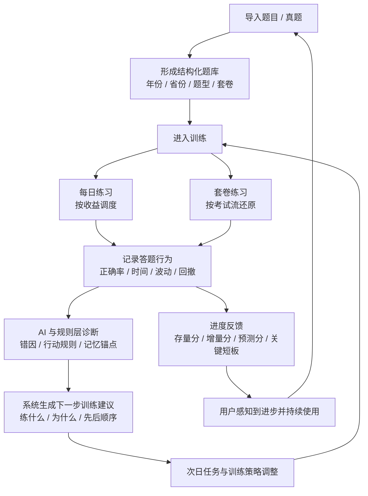

# 项目总览与路线图

> 更新时间：2026-03-19  
> 作用：用一份文档统一回答“这个系统到底要做什么、当前在哪、接下来先做什么”

---

## 1. 这份文档解决什么问题

当前项目文档已经不少，但分散在不同维度：

- `AGENTS.md`：协作原则与产品守则
- `docs/spec/技术方案_v7.9.md`：完整设计蓝图
- `docs/progress/完成度清单.md`：实现状态
- `docs/progress/系统审视与问题跟进.md`：关键问题审计
- `docs/progress/current_snapshot.md`：最近一轮工作快照

缺的是一份“总览层”文档，把这些内容压成一个统一口径：

- 系统的北极星目标是什么
- 主闭环是什么
- 当前系统最重要的短板是什么
- 接下来 2-6 周应该优先打什么
- 哪些东西先不要继续扩

这份文档就是那个总览层。

---

## 2. 系统北极星

这个系统不是“题库系统”，也不是“AI 解题系统”。

它真正要做的是：

**把题目数据、答题行为、错因诊断、训练调度，串成一个持续优化的个人提分引擎。**

换成用户语言，就是：

**让用户每天有限的练习时间，持续变成更高的考试得分。**

---

## 3. 核心目标拆解

系统必须同时完成 4 件事：

1. 低摩擦沉淀题目
2. 识别“为什么错”而不只是“错了”
3. 把诊断转成下一步训练动作
4. 让用户看见自己正在变强，从而愿意持续使用

如果只做到了 1 和 2，没有做到 3 和 4，系统会变成一个高级错题本。  
如果只做到了 1 和 4，没有做到 2 和 3，系统会变成一个带激励的刷题 App。  
只有 1-4 串起来，才是提分系统。

---

## 4. 主闭环

一句话理解：

- 导入层解决“有什么可练”
- 训练层解决“今天练什么”
- 诊断层解决“为什么错”
- 调度层解决“下一步该练什么”
- 反馈层解决“为什么要继续练”

---

## 5. 用户真正感知到的产品

用户实际只会感知 5 个核心场景：

1. 登录与首次配置
2. 导入真题 / 错题
3. 今日练习
4. 套卷练习
5. 进度与策略反馈

所以后续优先级必须围绕这 5 条主链，而不是围绕页面数量。

---

## 6. 当前系统已经具备的能力

结合 `完成度清单` 与近期实现，当前项目已经具备这些基础：

- 错题复习主引擎已存在：`mastery`、`errorROI`、`daily-tasks`
- 真题导入主链已具备：`PDF / Excel / DOCX` 解析、预览、查重、导入
- 套卷能力已进入可用态：套卷列表、共享聚合、详情、题号排序、考试流交互
- 练习流已分出多种模式：快速、深度、聚焦、计时
- 练习结果能沉淀到 `review submit`、`ActivityLog`、`session summary`
- AI 诊断、记忆锚点、知识库等基础能力已经挂上
- 进度页、预测分、模考记录、统计卡片已有一定基础设施

也就是说：

**系统不是从 0 到 1 的“概念期”，而是处在 1 到 10 的“主闭环打磨期”。**

---

## 7. 当前最核心的结构性短板

结合 `系统审视与问题跟进.md`，当前不是“功能不够多”，而是以下 4 个问题还没完全打穿：

### 7.1 进步反馈不够强

系统会算很多东西，但用户未必能直接感知：

- 今天练完涨了多少
- 距目标分还差哪里
- 这周主要补上了哪些短板

这会削弱持续使用的动力。

### 7.2 AI 诊断冷启动仍弱

AI 框架和知识库壳子在，但没有足够预热数据时，诊断质量还不够“行测专属”。

### 7.3 飞轮最后一环没完全闭合

系统已经会记录、会分析、会生成 insight，但还没有稳定把 insight 重新反哺回每日调度和参数调整。

### 7.4 主流程虽已通，但浏览器级回归还不够系统化

特别是：

- 导入 -> 成卷 -> 套卷练习
- 设置 -> 每日练习 -> 总结
- AI 失败态 / 接口失败态

这些还需要更稳定的验收纪律。

---

## 8. 当前阶段的正确策略

当前阶段不应该“继续扩功能池”，而应该按下面的顺序推进：

1. 稳主流程
2. 稳数据一致性
3. 稳训练闭环
4. 强化反馈与留存
5. 最后才扩新功能

这和 `AGENTS.md` 的原则一致：

- 先稳主流程
- 再修数据一致性
- 再打磨产品体验
- 最后扩展新功能

---

## 9. 接下来 2-6 周建议路线图

### Phase 1：主流程稳态化

目标：让用户从导入到练习到总结，整条链稳定可信。

重点：

- 套卷模式浏览器级回归
- 导入后成卷稳定性复核
- 设置保存与任务调度链路复核
- 所有关键页面失败态补齐

完成标志：

- 不再出现“请求失败但页面静默”
- 套卷与普通练习返回路径明确
- 重新导入 / 重复导入 / 历史真题数据都能稳定落到套卷

### Phase 2：反馈层升级

目标：让用户明确感知“我今天练了有什么价值”。

重点：

- 预测分核心卡片
- 存量分 / 增量分 / 差距来源展示
- 每日练习带来的分数变化展示
- 哪个题型离门槛最近的明确建议

完成标志：

- 用户练完后能回答“今天为什么值得练”
- 进度页不只是统计页，而是行动页

### Phase 3：AI 冷启动预热

目标：让 AI 从“能用”变成“有领域味道”。

重点：

- 导入 3-5 套真题
- 高质量解析喂入知识库
- 跑第一版 analysis-worker
- 对比知识库预热前后的诊断质量

完成标志：

- 诊断能说出具体方法论，不是泛泛而谈
- 行动规则具备迁移性

### Phase 4：飞轮闭环

目标：让系统不仅会记录和分析，还会主动调优训练策略。

重点：

- `SystemInsight` 反哺 `daily-tasks`
- 个性化 interval / errorROI 参数生效
- 管理或审核入口补齐

完成标志：

- 用户的训练节奏会因其行为数据而改变
- “越用越懂你”成为真实能力，不只是文案

---

## 10. 当前明确不该优先做的事

在主闭环未完全稳住前，以下内容都不应该抢优先级：

- AI 变式出题
- 用户出题模式
- 社区洞察蒸馏
- 复杂 RAG 扩展
- 纯装饰性统计页继续扩张
- 与主流程无关的管理型功能

原因很简单：

**它们会增加复杂度，但不会立刻提升主闭环的提分效率。**

---

## 11. 文档分工建议

后续建议把文档固定成下面这套分工：

- `AGENTS.md`
  负责协作规则、产品守则、开发纪律

- `docs/项目总览与路线图.md`
  负责系统目标、主闭环、阶段路线图、优先级口径

- `docs/spec/技术方案_v7.9.md`
  负责完整设计细节与功能蓝图

- `docs/progress/完成度清单.md`
  负责“哪些功能做了 / 没做”

- `docs/progress/系统审视与问题跟进.md`
  负责“哪些结构性问题还没解决”

- `docs/progress/current_snapshot.md`
  负责“最近这一轮刚做了什么、下次从哪继续”

---

## 12. 当前一句话判断

当前项目最值得做的，不是继续变“更大”，而是继续变“更稳、更闭环、更能让用户看见进步”。

如果后续每次迭代都能回答下面三个问题，方向就不会乱：

1. 这次改动有没有让主流程更顺
2. 这次改动有没有让系统更懂用户下一步该练什么
3. 这次改动有没有让用户更容易感知自己正在提分

只要三个问题里答不上两个，这个改动的优先级就应该下降。
